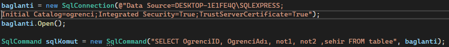

# SQL Veritabanına Bağlı Windows Form Kayıt Programı

Bu projede, C# ile Windows Forms ve SQL veritabanı kullanılarak kullanıcı bilgilerini bir veritabanına kaydetmeyi amaçlayan bir kayıt programı geliştirilmiştir. Uygulama, kullanıcıdan alınan bilgileri SQL veritabanına ekler ve veritabanından bilgi çekme işlemi gerçekleştirir.

## Proje Özellikleri:
- **Kullanıcı Ekleme:** Kullanıcı, bilgileri SQL veritabanından girerek, Form üzerinden verilerin çekilmesi sonucunda bilgileri görebilir
- **Veri Listeleme:** Veritabanında kayıtlı tüm kullanıcılar bir liste halinde görüntülenebilir.
- **Form Doğrulama:** Formda eksik bilgi girildiğinde kullanıcıya hata mesajı gösterilir.
- **SQL Bağlantısı:** SQL veritabanına bağlantı yapılır ve veriler CRUD (Create, Read,  ) işlemleri ile yönetilir.

## Kullanılan Teknolojiler:
- **C# (Windows Forms):** Kullanıcı arayüzü ve uygulama işleyişi için.
- **SQL:** Veritabanı yönetimi için.
- **ADO.NET:** SQL veritabanı ile bağlantı ve veri işlemleri için kullanılmıştır.

## Kurulum:
1. **SQL Veritabanı Ayarları:** Veritabanınızı kurup gerekli tabloları oluşturun.
2. **Bağlantı Dizesi (Connection String):** Proje içerisindeki veritabanı bağlantı dizesini kendi veritabanınıza göre güncelleyin.
3. **Projenin Çalıştırılması:** Visual Studio üzerinden projeyi çalıştırarak kayıt işlemlerini gerçekleştirebilirsiniz.

Bu proje, SQL veritabanı ile Windows Forms uygulamasının nasıl entegre edileceğini ve veri yönetimi işlemlerinin nasıl yapılacağını göstermektedir.

Not: Kurulum bölümünde 2 numaralı maddede belirttiğim üzere, Bağlantı Dizesi düzenlemesini yapmadığınız taktirde proje çalışmayacaktır.

Buradaki Bağlantı Dizelerini kendi bilgisayarınıza göre düzenlediğiniz zaman proje çalışacaktır.

